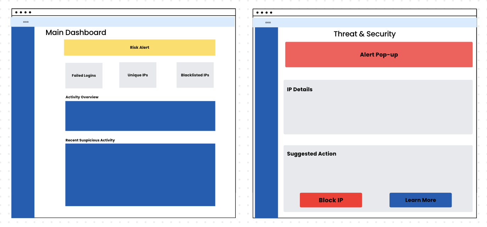
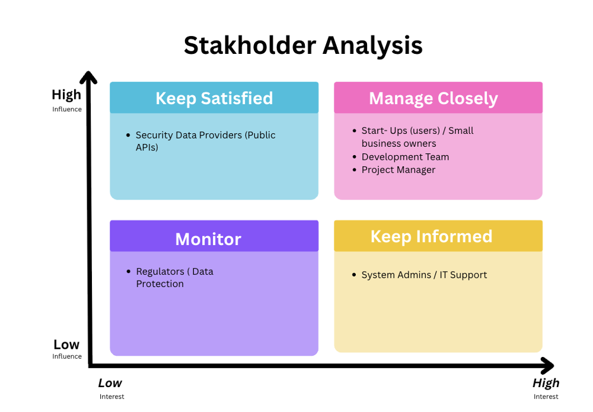
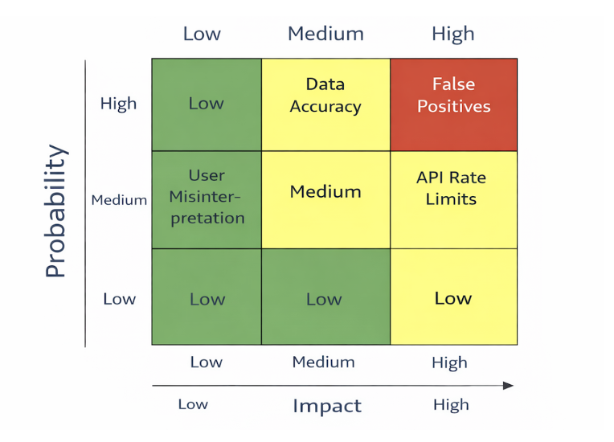
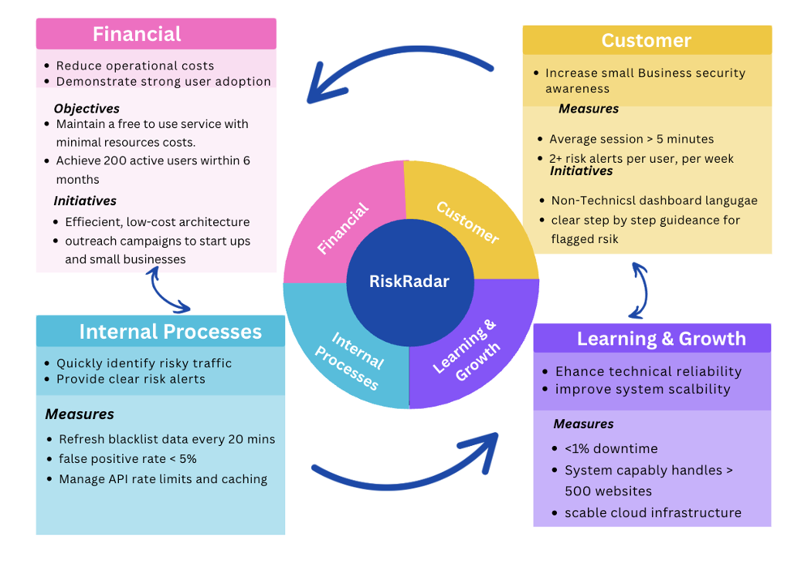
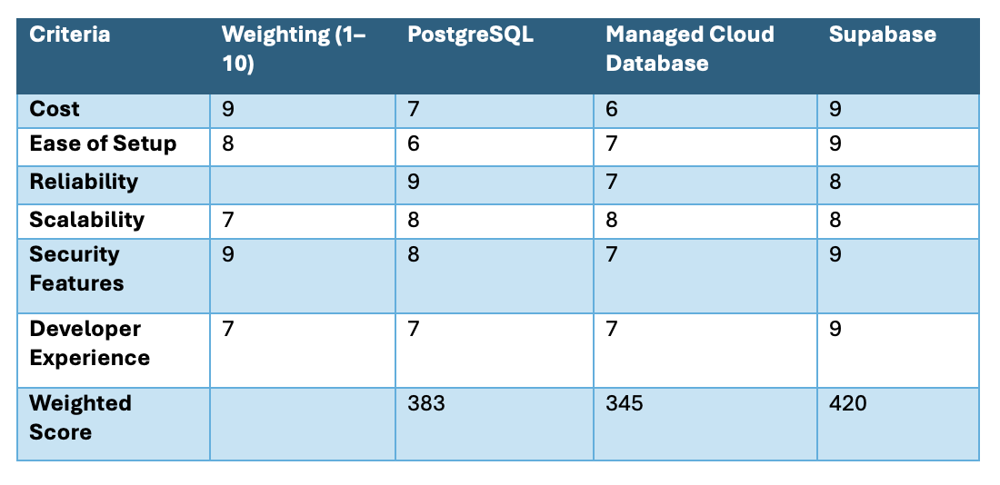
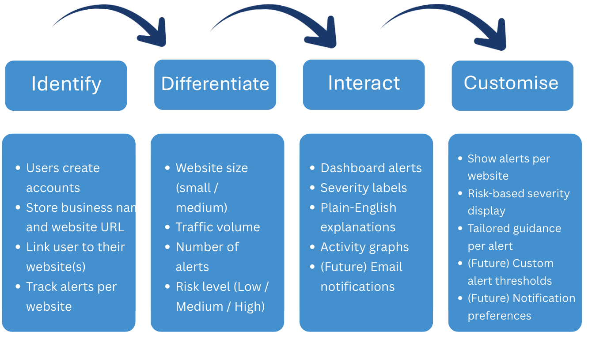

# 🛡️ RiskRadar  


## 📖 Project Description

RiskRadar is a free, lightweight web application designed to give small businesses and startups clear visibility into potential security risks affecting their websites.

Modern cyber-attacks no longer focus only on large organisations. Automated attacks regularly target small websites because they are less likely to have dedicated security teams or expensive monitoring tools.

RiskRadar continuously monitors website traffic and checks visitor IP addresses against trusted public threat intelligence services. If a visitor is associated with known malicious behaviour, RiskRadar highlights this in a simple dashboard.

Instead of showing technical logs or complex data, RiskRadar explains everything in plain English, allowing non-technical users to quickly understand:

- What is happening  
- Why it might be a concern  
- Whether action may be needed  

No security expertise is required.

RiskRadar acts as an early-warning system, helping users spot problems before they turn into serious incidents such as hacked accounts, website defacement, or service disruption.

<br>

## ❗ The Problem

Small businesses are increasingly targeted by:

- Brute-force login attempts  
- Credential-stuffing attacks using leaked passwords  
- Automated bots scanning for weaknesses  
- Traffic from known malicious IP addresses  

These attacks often occur silently and repeatedly.

Large organisations use expensive security platforms to detect this activity.  
Small businesses rarely have access to these tools.

As a result:

- Attacks go unnoticed  
- Accounts are compromised  
- Customer trust is damaged  
- Recovery is costly and time-consuming  

Most businesses only discover a problem after damage has already occurred.

<br>

## 💡 Why RiskRadar Exists

RiskRadar exists to provide simple, affordable security awareness.

Rather than overwhelming users with technical detail, RiskRadar focuses on three questions:

- Is anything suspicious happening?  
- Where is it coming from?  
- How serious does it appear?

By presenting only the most important security signals, RiskRadar allows users to make informed decisions without needing technical knowledge.

<br>

## 🎯 What RiskRadar Does

RiskRadar:

- Collects website traffic data  
- Extracts visitor IP addresses  
- Checks IPs against multiple public blacklist and reputation APIs  
- Stores and analyses results  
- Displays findings in a visual dashboard  

Users can:

- View a list of risky IP addresses  
- See unusual traffic spikes  
- View severity levels (Low, Medium, High)  
- Read plain-language explanations  
- Receive simple guidance  

Example alert:

> This IP address has been reported for brute-force login attempts.  
> If this IP appears frequently, consider blocking it or enabling stronger login protection.

<br>

## 👤 Who RiskRadar Is For

- Small business owners  
- Startup founders  
- Marketing teams  
- Solo developers  
- Non-technical staff  

If you manage a website and want basic security awareness without complexity, RiskRadar is for you.

<br>

## ⭐ Our Promise

- Free and easy to use  
- No security knowledge required  
- Clear explanations  
- Actionable insights  
- Transparent about limitations  

RiskRadar does not replace professional security services.  
It provides visibility so issues are spotted earlier.

<br>

## ▶️ Installation & Usage

The following steps work on **Windows, macOS, and Linux**.

### Requirements

- Node.js (version 18 or later)  
- npm (comes with Node.js)  
- Git  

<br>

## ▶️ Installation & Usage (Beginner Friendly)

These steps help you run RiskRadar on your own computer using **localhost** (your computer only).  
It works on **Windows** and **macOS**.

#### ✅ Step 1: Install what you need

You only need three things:

1) **Node.js (version 18 or later)**  
- Install from the official Node.js website  
- Node.js comes with **npm**, which RiskRadar needs to run

2) **Git** (used to download the project)  
- Install Git for your computer

3) A code editor (optional, but helpful)  
- We recommend **Visual Studio Code**
 <br>

####  ✅ Step 2: Download (clone) RiskRadar from GitHub

 Option A (Recommended): Use the Terminal / Command Prompt

1) Open your computer’s terminal:

- **Windows:** Open *PowerShell*  
- **macOS:** Open *Terminal*

2) Copy and paste this command, then press **Enter**:

     ```git clone https://github.com/harleendhillon25/ProjectBeta```

3) Move into the Project folder by using the following command.
-   cd ProjectBeta

### ✅ Step 3: Install the Project

1) To run everything RiskRadar needs run the following command

 ```bash
npm install
npm run server
npm run client
```
<br>

## 🛠️ Technologies

- JavaScript  
- Node.js  
- PostgreSQL
- Supabase  
- Visual studio code 

<br>
<br>


## 🔁 Process

1. Researched common threats affecting small businesses.  
2. Selected reliable public threat intelligence APIs.  
3. Designed simple user flows.  
4. Built backend services for data collection.  
5. Implemented caching and scheduled updates.  
6. Built frontend dashboard.  
7. Added severity scoring.  
8. Wrote plain-language explanations.  
9. Tested with sample traffic.


## 📸 Screenshots

### Lower Wireframes 
![Low fidelity ]
### Higher Fifelity Wireframes 



<br>

## 🔁 Data Flow Diagram

<br>

## 👥 Stakeholder Analysis

The following stakeholders influence the design, delivery, and success of RiskRadar.

- **Small Businesses & Start-ups (End Users) – High Influence / High Impact**  
Primary users who rely on RiskRadar to identify security risks without technical knowledge. Their needs drive usability and core functionality.

- **Founders / Business Owners – High Influence / High Impact**  
Decision-makers who approve adoption and act on security insights. Their trust is critical to platform success.

- **Development Team – High Influence / Medium Impact**  
Build and maintain the platform. Their technical decisions affect reliability, performance, and scalability.

- **Threat Intelligence API Providers – Medium Influence / Medium Impact**  
Provide IP reputation and blacklist data. Their reliability directly affects alert accuracy.

- **Cyber-Security Community / Regulators – Low–Medium Influence / Low Impact**  
Influence standards and compliance, supporting long-term trust and credibility.



<br>

## ⚠️ Risk Analysis

The following key risks were identified for RiskRadar, along with simple mitigation strategies.

- **False Positives (High Impact / High Likelihood)**  
Legitimate activity may be flagged as suspicious.  
*Mitigation:* Severity levels, confidence indicators, and clear explanations.

- **Data Accuracy (Medium Impact / High Likelihood)**  
External threat data may be outdated or incomplete.  
*Mitigation:* Use multiple data sources and display last-updated times.

- **API Rate Limits (High Impact / Medium Likelihood)**  
External services may restrict request volumes.  
*Mitigation:* Scheduled requests, caching, and fallback mechanisms.

- **User Misinterpretation (Low Impact / Medium Likelihood)**  
Users may assume alerts confirm an attack.  
*Mitigation:* Plain-English guidance, tooltips, and disclaimers.

- **Scope Creep (Medium Impact / Medium Likelihood)**  
Too many features may delay delivery.  
*Mitigation:* Strong MVP boundaries.



<br>
## 📊 Balanced Scorecard

The Balanced Scorecard shows how RiskRadar will succeed by focusing on four connected areas: Financial, Customer, Internal Processes, and Learning & Growth. Together, these ensure RiskRadar is affordable, useful, reliable, and able to grow.

### Financial
Keep RiskRadar free and low-cost while growing the number of users.

### Customer
Make security easy to understand through clear alerts and simple guidance.

### Internal Processes
Quickly detect risky activity and reduce false alerts.

### Learning & Growth
Maintain a reliable system that can scale as usage increases.



<br>

## 🧮 Decision Matrix – Data Storage Choice

To choose the best way to store RiskRadar’s data, a decision matrix was created comparing different storage approaches based on:

- Cost  
- Ease of setup  
- Reliability  
- Security  
- Ability to scale  

An **All in One Backend Platform** was selected because it is low-cost, easy to maintain, includes built-in security, and can grow as more users join. This allows the team to focus on improving RiskRadar rather than managing infrastructure.



<br>

## 🔁 IDIC Model (Customer Relationship Approach)

RiskRadar uses the IDIC model to build strong and meaningful relationships with users by identifying who they are, understanding their needs, communicating clearly, and tailoring their experience.

### Identify  
RiskRadar identifies users by creating accounts, storing basic business details, and linking each user to their website(s). This ensures alerts and data are always connected to the correct website owner.

### Differentiate  
RiskRadar understands that not all websites face the same level of risk. Users are differentiated by website size, traffic volume, number of alerts, and overall risk level (Low / Medium / High).

### Interact  
RiskRadar communicates through dashboard alerts, severity labels, plain-English explanations, and activity graphs. This keeps users informed without technical jargon.

### Customise  
RiskRadar tailors the experience by showing alerts per website, displaying risk-based severity, and providing guidance specific to each alert. Future options include custom alert thresholds and notification preferences.



 <br>

## 🏆 Wins & Challenges

### Wins

- Successfully integrated external APIs  
- Built working dashboard  
- Created simple explanations  
- Designed non-technical interface  

### Challenges

- Managing API limits  
- Reducing false positives  
- Keeping explanations accurate but simple  

<br>
## 🐞 Bugs

- Occasional delayed API responses  
- No automated blocking  

<br>

## 🚀 Future Features

- Email alerts  
- Geo-location map  
- Historical trends  
- Custom thresholds  
- Exportable reports  
- Optional authentication  

<br>

## 🔐 Security & Privacy

- No personal data collected  
- IP addresses stored only for analysis  
- HTTPS enforced  
- No password storage  

<br>